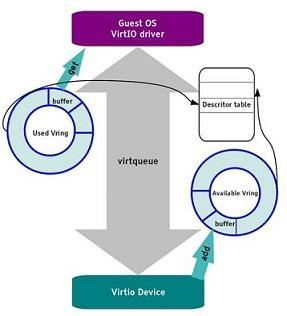
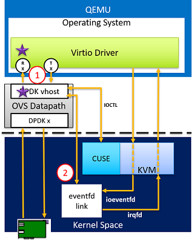
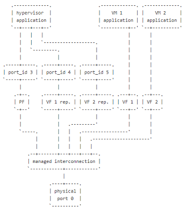

众所周知，虚拟化技术旨在将有限的物理资源（CPU、内存等）抽象成更多份的虚拟资源供上层应用使用。最常用的领域有云服务提供商，SDN/NFV，比如：在一台物理服务器上运行成百上千的虚拟机，并将单个虚拟机出租给不同用户。

虚拟化的实现主要由三项关键技术构成：CPU虚拟化、内存虚拟化和I/O虚拟化。其中CPU和内存虚拟化多由硬件支持实现，如intel VT-x、VT-d等IA架构扩展，还有EPT页表等。而I/O虚拟化则没有CPU和内存虚拟化那么统一，由于其大量基于软件实现，因此发展过程中，衍生出了好多种性能、灵活性各异的方案。我们通常所说的全虚拟化和半虚拟化一般都是在网络I/O虚拟化中体现的差异最大。

# 1.网络I/O全虚拟化

该方式采用**软件模拟真实硬件设备**。一个设备的所有功能或者总线结构（如设备枚举、识别、中断和DMA）等都可以在宿主机中模拟。而对客户机而言看到的是一个功能齐全的“真实”的硬件设备。其实现上通常需要宿主机上的软件配合截取客户机对I/O设备的各种请求，通过软件去模拟。比如：QEMU/KVM虚拟化中QEMU就可以通过模拟各种类型的网卡。

这种方式的好处是**灵活，不需要专有驱动**，因此能实现既不需要修改客户机、也无需考虑底层硬件，对客户机透明地使用网络资源。但是缺点在于，很多中断信号的处理需要让客户机感觉到自己运行在一个“真实环境”，因此QEMU软件模拟的很底层，**效率低下**。

# 2.网络I/O半虚拟化

在这种虚拟化中，客户机操作系统能够感知到自己是虚拟机，I/O的虚拟化由前端驱动和后端驱动共同模拟实现。**在客户机中运行的驱动程序称之为前端，在宿主机上与前端通信的驱动程序称之为后端。前端发送客户机请求给后端，后端驱动处理完这些请求后再返回给前端。**而在不同的虚拟化机制中，这一过程的实现手段也有所区别，例如：Xen中的共享内存、授权表，KVM中的virtio。它相比于全虚拟化的好处在于，不再需要宿主机上专门的软件去模拟实现I/O请求，因此不会有VM-exit，性能会有所提升。

半虚拟化中的virtio是IBM于2005年提出的一套方案[1]，经过了十多年的发展，其驱动现在基本已经被主流的操作系统接纳编入内核，因此virtio也已经成为半虚拟化的一套事实标准。其主要结构如下图所示，前后端驱动通过虚拟队列通信，虚拟队列中又包含used ring、avail ring和desc ring。其具体接口标准参见IBM网站https://www.ibm.com/developerworks/cn/linux/1402_caobb_virtio/
，这里不做过多介绍。

以virtio为标准的半虚拟化在其追寻性能的道路上也历经了三个演进方案：virtio-net、vhost-net和vhost-user。

### virtio-net

如下图所示，KVM负责为程序提供虚拟化硬件的内核模块，QEMU利用KVM模拟VM运行环境，包括处理器和外设等；Tap是内核中的虚拟以太网设备，可以理解为内核bridge。

当客户机发送报文时，它会利用消息通知机制通知KVM，并退出到用户空间的QEMU进程，然后由QEMU对Tap设备进行读写（需要说明的是，QEMU是VM运行的主进程，因此才有退出这一说）。
在该模型中，**宿主机、客户机和QEMU存在大量的上下文切换，以及频繁的数据拷贝、CPU特权级切换**，因此性能差强人意。其函数调用路径如下：

**两次报文拷贝**导致性能瓶颈，另外消息机制处理过程太长：报文到达Tap时内核通知QEMU，QEMU利用IOCTL向KVM请求中断，KVM发送中断到客户机。

### vhost-net

针对virtio-net的优化是把QEMU从消息队列的处理中解放出来，直接在宿主机实现了一个vhost-net内核模块，专门做virtio的后端，以此减少上下文切换和数据包拷贝。

其结构如下图所示，以报文接收过程为例。数据通路直接从Tap设备接收数据报文，通过vhost-net内核模块把报文拷贝到虚拟队列中的数据区，从而使客户机接收报文。消息通路是当报文从Tap设备到达vhost-net时，通过KVM向客户机发送中断，通知客户机接收报文。

**在数据通路层面，vhost-net减少了内存拷贝，但是由于其后端运行在内核态，仍然存在性能瓶颈。**

### vhost-user

vhost-user是采用DPDK用户态后端实现的高性能半虚拟化网络I/O。其实现机理与vhost-net类似，但是整个后端包括ovs（openvswitch） datapath全部置于用户空间，更好的利用DPDK加速。

然而由于OVS进程是用户态进程，无权限访问客户机内存，因此需要使用共享内存技术，提前通过socket通信在客户机启动时，告知OVS自己的内存布局和virtio中虚拟队列信息等。这样OVS建立起对每个VM的共享内存，便可以在用户态实现上述vhost-net内核模块的功能。

### vDPA加速的vhost-user

在DPDK加速的vhost-user方案中，还有一次内存拷贝。半虚拟化中仅剩的性能瓶颈也就在这一次拷贝中，intel推出了一款硬件解决方案，直接让网卡与客户机内的virtio虚拟队列交互，把数据包DMA到客户机buffer内，在支持了virtio标准的基础上实现了真正意义上的**零拷贝**。

在18.05以后的DPDK版本中，已经有支持vDPA的feature供选择了。

# 3.I/O透传

对于性能的追求是永无止境的，除了上述全虚拟化、半虚拟化两种I/O虚拟化以外，还有一种非常极端的做法。让物理设备穿过宿主机、虚拟化层，直接被客户机使用，这种方式通常可以获取近乎native的性能。

这种方式主要缺点是：
***1.硬件资源昂贵且有限。***
***2.动态迁移问题，宿主机并不知道设备的运行的内部状态，状态无法迁移或恢复。***

DPDK针对这两点问题都做了一定程度的解决。另外还提供了一种基于硬件的PF（物理功能）转VF（虚拟功能），这相当于在网卡层面上就已经有了虚拟化的概念，把一个网卡的PF虚拟成几十上百个VF，这样可以把不同的VF透传给不同的虚拟机，这就是我们最熟悉的SR-IOV。

对于I/O透传在虚拟化环境中最严重的问题不是性能了，而是灵活性。客户机和网卡之间没有任何软件中间层过度，也就意味着不存在负责交换转发功能的I/O栈，也就不会有软件交换机。那么如果要想有一台server内部的软件交换功能如何实现呢。业界的主要做法是把交换功能完全下沉到网卡，直接在智能网卡上实现虚拟交换功能。这又带来了另一个问题，成本和性能的权衡。

而DPDK 18.05以后的版本似乎也解决了这一灵活性问题，为了充分发掘标准网卡（区别于智能网卡）在flow（流）层面上的功能，推出了VF representer。可以直接将OVS上的流表规则下发到网卡上，实现网卡在VF之间的交换功能，这样就实现了高效灵活的虚拟化网络配置。

***引用：***

全虚拟化、半虚拟化和I/O透传主体观点来自《深入浅出DPDK》  

[1] Russell R . virtio : Towards a De-Facto Standard For Virtual I/O Devices[M]. ACM, 2008. 

*图引用：*

图1 引用自 IBM developer <https://www.ibm.com/developerworks/cn/linux/1402_caobb_virtio/>  

图2、4、5 引用自 “Accelerating the Path to the Guest - Maryam Tahhan and Kevin Traynor, Intel”  

图6 引用自 KVM forum 2017 “virtio: vhost Data Path Acceleration towards NFV Cloud - Cunming Liang, Intel”  

图7 引用自 DPDK官网文档
 <https://doc.dpdk.org/guides/prog_guide/switch_representation.html?highlight=representer>