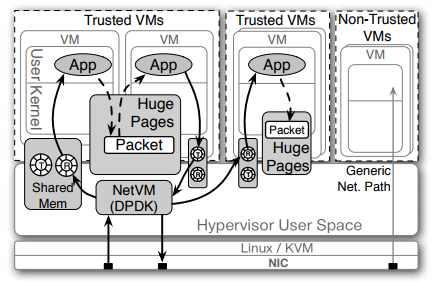
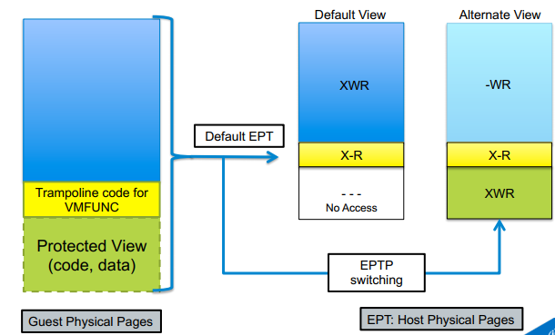
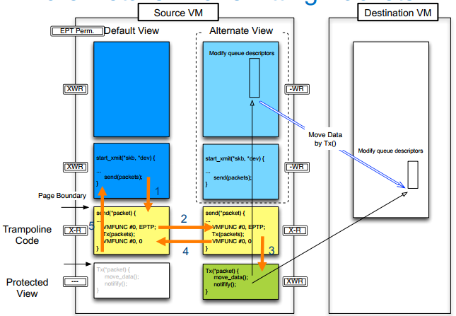

数据包的拷贝是虚拟化网络中最大的性能瓶颈，这些年来，人们也一直在致力于减少内存拷贝甚至消除内存拷贝。根据数据包流向，零拷贝可以分为 Host to VM 的零拷贝和 VM to VM 的零拷贝，前者主要适用于一般的情况，后者更适用于NFV。本文简单枚举下现有的零拷贝的虚拟化网络实现。

# 1.Host to VM零拷贝
除去之前的文章中讲过的设备透传之外，数据包到达物理网卡在转发之前都必须被存储在主机的数据包缓冲区中，这样要想实现零拷贝，必须允许虚拟机能够直接访问该处的数据包。现有实现有两种方式，一种是采用更决绝的共享内存技术，另一种是在EPT页表层面做一些动态修改。

### 基于共享内存实现零拷贝
早在09年就有一位博士在自己的毕业设计中提出了一种零拷贝的虚拟化网络IO接口实现，并以Nahanni命名了这种设计的设备和驱动名[1,2]，这便是IVSHMEM的前身。但是不幸的是，尽管这位博士在自己论文中以极具攻击性的语气诋毁了社区选择virtio方案的愚蠢行为，但是由于这种共享内存的设计太过大胆，存在严重的安全隐患，因而始终不被内核开发者接纳。

几年以后，这项技术反而在一个新兴的方向被提出，而被更多人知晓。也许没有很多人知道IVSHMEM，但一定知道14年NSDI计算机网络顶级会议上提出的NetVM，他使用的是相同的设计思想，将之应用于NFV领域，并实现了编程所需的基本框架[3]。NetVM代表了虚拟化网络IO中零拷贝共享内存是最好实现，那么这里就用NetVM为例介绍一下这种技术如何发挥作用。

**他实现零拷贝的思路就是：让host的数据包buffer共享给VM，使得VM有能力直接访问主机上属于自己的数据包。另外，还需要共享一对队列，用于VM与host传输数据包过程中的交互，互相指明数据包存在哪了。**

这项方式有两点缺点：由于需要VM实现对共享内存内部数据包的直接读取（无须拷贝到自己的buffer），就需要在VM中改写**专有驱动**，来完成对共享内存这块buffer的内存管理；对于多个VM共享一块内存作为数据包缓冲区，意味着上面的数据包可以随意访问，存在安全性隐患。也正是这两点原因，这项方案难以大规模使用。

>但是它在NFV环境下，多VM共享一块内存的设计却是提升性能的关键。因为NFV旨在利用虚拟化的资源（如：VM或者容器）来实现物理设备实现的网络功能，从而构成服务链，也就是说一条服务链上可能有很多个运行不同网络功能的虚拟机，数据包（flow）需要穿过这么多虚拟机，内存拷贝会让性能急剧下降。因此，在NetVM方案下，一个数据包可以同时被一条服务链上所有的VM访问，结合一些NFV并行化的操作，可以大大提高NFV的性能。

下面简要说明一下这种直接host与VM共享内存是如何实现的吧。

答案还是**设备模拟，使用设备内存**。QEMU是VM主进程，也是负责给VM提供所有的设备模拟的。在启动VM的时候，QEMU给VM虚拟出来一个PCI设备，并将host的buffer作为设备内存注册进设备的数据结构。这样一旦VM需要访问设备的时候，就会被重定向到host的buffer。

### page-flipping实现零拷贝
这项技术在十年前，就有人提出并在Xen虚拟化机制上做了实现。最近，也有人把它实现在了QEMU/KVM虚拟化上，并且基于的是vhost-user做改动[4]。

这种方法的设计思想是：**VM内存访问是经过EPT页表，将GPA（Guest Physical Address）翻译成HPA（Host Physical Address），既然这样就可以不用共享内存，直接改数据包所在页的EPT页表表项，使得VM访存时被重定向到数据包所在的物理页。**

这种方式就是“简单粗暴”，需要修改网卡驱动对内存的管理，以及KVM内核代码，允许EPT表项映射关系被动态修改。这也正是其缺陷所在，不论数据包大小，每次数据包传输都需要改EPT表项，而这是一个很昂贵的操作。实验结果表明，它拖累了小包的传输，**只有在数据包大小超过1518字节（那也就是只有巨型帧了），这种方式才比数据包拷贝要快。**

# 2.VM to VM零拷贝
其实上面所说的NetVM和IVSHMEM已经实现的VM间零拷贝了，这里就说下vhost-user尚未开源的一些设计。

因为virtio已经被社区接纳并且进入大部分操作系统的内核，因此对基于virtio的各项feature的优化，还是有很多人在做。我这里要说的就是virtio在VM间共享内存的技术vhost-pci。

**它的想法非常直接，如果一个VM能够直接从另一个VM中读取数据包而不需要拷贝，那么可以极大加快服务链上的效率。这在实现上非常类似NetVM和IVSHMEM，为需要进行VM to VM传输的VM虚拟一个热插拔设备叫做vhost-pci，设备内存就是另一个VM的内存，在VM中再实现一套驱动，让VM间通信变得类似于vhost-user的前后端操作，就可以实现零拷贝。**在github上已经有vhost-pci的实现了：<https://github.com/wei-w-wang/>vhost-pci，不知道为什么没有推进社区。

>关于虚拟机间通信，Intel和开源社区也还有一个更灵活的想法，让每个QEMU进程有“弱交换机”的功能，VM在往外发送数据包的时候由这个“弱交换机”判断是VM间通信还是与外部通信，从而确定走vhost-pci快速通道还是走OVS转发。而这些QEMU“弱交换机”还会和OVS进行交互更新流表项等操作。当初见到这个设计的时候真的佩服设计者的脑洞，但是现在还是停在原型验证阶段，可能里面还有什么巨坑吧。

但是这项快速通路带来了另一个问题——安全问题。考虑到允许一个VM直接访问另一个VM内存，这是一项极其危险的操作，如果能有一个“protected view”去做这项事情就好了。

为了实现这项安全地访问外部资源（敏感资源）的技术，Intel直接在硬件层面上下功夫了，并为此申请了全球专利。这项技术叫做EPTP switching。这项技术允许一个VM拥有多个EPT页表，通过写寄存器，实现EPT页表之间的切换。

>科普一下，它不仅可以用于安全地访问外部资源上，由于它的开销极低，一些虚拟机内存监视器也使用了该方法。去年“熔断”和“幽灵”两大漏洞让Linux社区为此重新设计了页表，提出的KPTI让性能降低很多；因此有人认为在云上，虚拟机可以不用打这么大开销的补丁，可以直接利用多项EPT页表技术来实现对VM内存的监视[5]。

回到vhost-pci策略上来，**我们为一个VM建立两个EPT页表：一个是default页表，另一个是包含别的VM内存的EPT页表。可以调用VMFUNC中的EPTP switching在这两种页表之间切换。**

在这种机制下的数据包传输就变成上图这样：在进入发送函数时，目的VM的内存是不可见的；先调用VMFUNC切换到protected view，目的VM的内存可见，进行数据包send；发送完以后，再调用VMFUNC切换default EPT页表，目的VM的内存又变得不可见了。

这样就实现了既安全又高效的VM间数据传输，可惜这套方案已经被专利保护，再没有发挥余地了。

*引用：*
[1] Macdonell A C. Shared-memory optimizations for virtual machines[J]. 2011.  

[2] MacDonell C. Nahanni, a shared memory interface for kvm[J]. Aug, 2010, 10: 19.  

[3] Hwang J, Ramakrishnan K K, Wood T. NetVM: High Performance and Flexible Networking Using Virtualization on Commodity Platforms[C]//11th {USENIX} Symposium on Networked Systems Design and Implementation ({NSDI} 14). 2014: 445-458.  

[4] Wang D, Hua B, Lu L, et al. Zcopy-vhost: Eliminating Packet Copying in Virtual Network I/O[C]//2017 IEEE 42nd Conference on Local Computer Networks (LCN). IEEE, 2017: 632-639.  

[5] Hua Z, Du D, Xia Y, et al. {EPTI}: Efficient Defence against Meltdown Attack for Unpatched VMs[C]//2018 {USENIX} Annual Technical Conference ({USENIX}{ATC} 18). 2018: 255-266.

*vhost-pci中图 来源于 “Extending KVM Models Toward High-Performance NFV; Jun Nakajima, James Tsai, Mesut Ergin, Yang Zhang, and Wei Wang; Intel”*