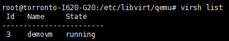
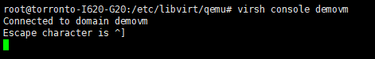
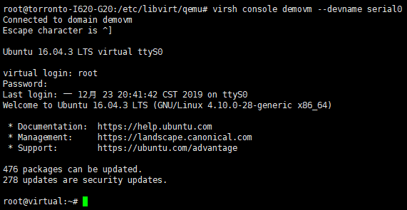
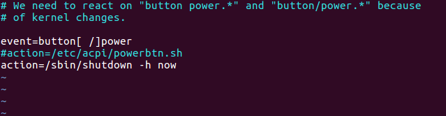

使用QEMU/KVM虚拟化平台启动虚拟机，通常需要手动输入一行很长的命令，里面可能有几十个参数，要想启动多个虚拟机，以及监视多个虚拟机运行状态会非常困难，这时候就需要virsh这样一个虚拟机的管理工具。

由于前面的文章已经介绍了如何安装QEMU以及如何启动虚拟机，这里就直接从QEMU/KVM安装好以后的地方开始。

# 1.安装libvirt

在ubuntu系统中，使用apt-get安装的libvirt还是1.3版本的，有很多兼容性的问题。这里选择源码安装libvirt。

先卸载系统默认安装的libvirt(如果没有安装忽略这一步):

```sudo apt-get purge libvirt```

安装所需环境(其他需要的configure的时候会提示安装的)：

```
sudo apt-get install libpolkit-agent-1-0 libpolkit-backend-1-0 libpolkit-gobject-1-0 libpolkit-gtk-mate-1-0 libxml++2.6-dev libdevmapper-dev libnl-3-dev libgnutls-dev libpciaccess-dev libnl-route-3-dev libyajl-dev xsltproc
```

前往官网下载libvirt源码:https://libvirt.org/sources/

我这里下载的是 libvirt-4.10.0.tar.xz，在ubuntu系统中解压，编译，安装：

```
tar xvJf libvirt-4.10.0.tar.xz
cd libvirt-4.10.0/
./configure --prefix=/usr --localstatedir=/var --sysconfdir=/etc  #不指定的话默认会给安装到/usr/local目录下
make & make install
```

安装完成后检查是否安装成功：

```
# which libvirtd
/usr/sbin/libvirtd
# libvirtd --version
libvirtd (libvirt) 4.10.0
# which virsh
/usr/bin/virsh
# virsh -v
4.10.0
```

安装成功后启动libvirtd服务：

```
sudo systemctl restart libvirtd
```

# 2.通过虚拟机模板xml文件启动虚拟机

用virsh启动虚拟机需要有对应的xml文件，virsh可以生成这些模板文件。

如何用iso创建虚拟磁盘直接使用qemu-img即可，之前文章讲过。这里直接默认虚拟磁盘已创建并完成安装。使用vhost-user网络接口的虚拟机xml文件如下：

```
<domain type='kvm'>
  <name>demovm</name>
  <uuid>4a9b3f53-fa2a-47f3-a757-dd87720d9d1d</uuid>
  <memory unit='KiB'>4194304</memory>
  <currentMemory unit='KiB'>4194304</currentMemory>
  <memoryBacking>
    <hugepages>
      <page size='1' unit='G' nodeset='0'/>
    </hugepages>
  </memoryBacking>
  <vcpu placement='static'>2</vcpu>
  <cputune>
    <shares>4096</shares>
    <vcpupin vcpu='0' cpuset='4'/>
    <vcpupin vcpu='1' cpuset='5'/>
    <emulatorpin cpuset='4,5'/>
  </cputune>
  <os>
    <type arch='x86_64' machine='pc'>hvm</type>
    <boot dev='hd'/>
  </os>
  <features>
    <acpi/>
    <apic/>
  </features>
  <cpu mode='host-model'>
    <model fallback='allow'/>
    <topology sockets='2' cores='1' threads='1'/>
    <numa>
      <cell id='0' cpus='0-1' memory='4194304' unit='KiB' memAccess='shared'/>
    </numa>
  </cpu>
  <on_poweroff>destroy</on_poweroff>
  <on_reboot>restart</on_reboot>
  <on_crash>destroy</on_crash>
  <devices>
    <emulator>/usr/bin/qemu-system-x86_64</emulator>
    <disk type='file' device='disk'>
      <driver name='qemu' type='qcow2' cache='none'/>
      <source file='/var/iso/virtual1.qcow2'/>
      <target dev='vda' bus='virtio'/>
    </disk>
    <interface type='vhostuser'>
      <mac address='00:00:00:00:00:01'/>
      <source type='unix' path='/tmp/sock0' mode='server'/>
       <model type='virtio'/>
      <driver queues='2'>
        <host mrg_rxbuf='on'/>
      </driver>
    </interface>
    <serial type='pty'>
      <target port='0'/>
    </serial>
    <console type='pty'>
      <target type='serial' port='0'/>
    </console>
    <input type='mouse' bus='ps2'/>
    <graphics type='vnc' port='-1' autoport='yes' listen='0.0.0.0' keymap='en-us'/>
  </devices>
</domain>
```

这个xml文件给虚拟机配置了各种物理设备信息：给虚拟机起名为demovm，配置了绑定物理核的两块虚拟CPU核，内存使用预分配的1GB大页面，总内存4GB，虚拟磁盘文件在'/var/iso/virtual1.qcow2'，使用virtio的vhost-user网络接口，一个串口console和一个VNC端口。虚拟机的xml文件非常复杂，只要配置有一项不兼容或者设置出错就会导致启动失败。

先定义该模板虚拟机：

```virsh define test.xml```

在已经启动了OVS并开放vhost端口情况下，启动虚拟机：

```virsh start demovm```

通过virsh list已经可以看到虚拟机运行起来了：


# 3.远程终端和关闭虚拟机

开启虚拟机以后，我们可以通过连接到刚才设置的console来访问虚拟机的终端：

```virsh console demovm --devname serial0```

但是问题出现了，为什么光标一直卡在这，没有进入终端：



通过VNC连接到虚拟机（这里用的是tightVNC），终端输入：

```
sudo systemctl disable systemd-networkd-wait-online
sudo systemctl ensble serial-getty@ttyS0.service
sudo systemctl start serial-getty@ttyS0.service
```

重新启动虚拟机再次尝试，成功：



尝试用virsh关闭虚拟机：

```virsh shutdown demovm```

发现虚拟机并没有关机还在运行，登录VNC查看，原来是图形化界面的原因，开启了用户选择界面：


查阅资料virsh的shutdown命令是通过acpi传递到虚拟机里的，进入虚拟机终端，进入acpi事件处理目录，修改powerbtn事件处理配置文件：

```
cd /etc/acpi/events/
vim powerbtn
```



重启回到virsh控制台，成功关机。