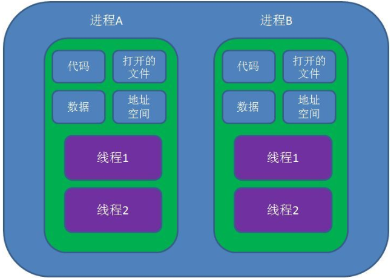

隔离了一个多星期，在家待的倦的不行，刚好看博客有人实现了用户态线程切换，一看这不就协程吗。于是乎自己也编了个玩玩，也顺带复习一下操作系统知识，以及理一理一些对数据平面未来发展趋势的思考。

# 1.进程和线程

**进程和线程是我们操作系统实实在在的基本单位，操作系统教程把进程称为程序及其运行的所有资源集合。也就是包含了代码和打开的文件资源、数据资源、独立的内存空间等。实际上操作系统就是由一个个的进程组成的，操作系统本身就是运行在一堆进程上的。**

**而线程从属于进程，是程序的实际执行者，一个进程至少包含一个主线程，也可以有更多的子线程，线程拥有自己的栈空间。**但是对于其他的资源，比方说mmap了一块内存，这些是该进程下所有线程都可以访问的。因此对于操作系统而言，进程是最好的资源隔离单位。
>（最近两年由于硬件的发展，也有一些工具如**pkey**能够限制线程私有一些内存资源）

因此对操作系统而言，**线程是最小的执行单元，进程是最小的资源管理单元**。（最小的执行单位也意味着是最小的调度单元，很多面试时候会问）


上面介绍的是概念，但是在实际的物理计算机上，你线程是得跑在CPU上的啊。所以一个进程创建的线程越多，就需要更多的CPU资源来运行这些线程，这样下去万一CPU不够用怎么办，这就需要调度了。最简单直观的想法就是，每个线程在这个CPU上跑一小段时间让给别的线程跑，自己休眠起来。

在linux系统上我们用的最多的多线程是pthread，它不是gnu C自带的，所以编译时候要链接上-lpthread，我们最常用的就直接pthread_create来创建一个线程，它的工作内容就在函数参数句柄里就完事了。高阶一点的知道绑核，设置CPU亲和性，但事实上线程能设置的属性也包括调度，简单介绍下pthread的一些API：

```
1. int pthread_create(pthread_t *thread, const pthread_attr_t *attr, void *(*start_routine)(void*), void *arg); 
//不多说，创造线程，给个线程入口函数
2. int pthread_join(pthread_t thread, void **retval);
//第一个参数就是创建的线程的句柄了，而第二个参数就会去接受线程的返回值。pthread_join()接口会阻塞主进程的执行，直到合并的线程执行结束。
3. int pthread_attr_init(pthread_attr_t *attr);
//attr为设置线程属性的结构体，初始化改结构体，  一般地，Linux下的线程有：绑定属性、分离属性、调度属性、堆栈大小属性和满占警戒区大小属性。用在创建线程函数的第二个参数生效
4. int pthread_attr_destory(pthread_attr_t *attr); 
//销毁线程属性结构体
5. int pthread_attr_setschedpolicy(pthread_attr_t *attr, int policy);
//设置线程的调度属性，有SCHED_OTHER、SCHED_RR、SCHED_FIFO等。
6. int pthread_attr_setschedparam(pthread_attr_t *attr, struct sched_param *param); 
//设置线程在该调度模式下的优先级，例如
    struct sched_param param;
    param.sched_priority=30;
    pthread_attr_setschedparam(&attr,&param);
7. int pthread_attr_setinheritsched(pthread_attr_t *attr, int inheritsched);  
//是否继承父线程的调度模式，它的第二个参数有两个取值：PTHREAD_INHERIT_SCHED（拥有继承权）和PTHREAD_EXPLICIT_SCHED（放弃继承权）。新线程在默认情况下是拥有继承权。 如果想要自己设置该线程调度，只能选择不继承。
8. int pthread_attr_setaffinity_np(pthread_attr_t *attr, size_t cpusetsize, const cpu_set_t *cpuset);
//设置线程的CPU亲和性，俗称的绑核，使用如下：
    cpu_set_t mask;
    CPU_ZERO(&mask);
    CPU_SET(6,&mask);
    if(pthread_attr_setaffinity_np(&attr,sizeof(mask),&mask)==-1)
    {
        printf("pthread_attr_setaffinity_np erro\n");
    }
```

再剩下的就是一些同步，信号量和锁一类的，因为生产者消费者问题是多个线程临界区的经典问题。网络中也很经典，像收发队列，对环表的操作就是这一类问题。

但是这样带来的缺点是，性能损耗大。既然要让出CPU来休眠，那么线程就需要保存当前执行的各项寄存器的值（即上下文切换），以保证切换回来的时候还能继续运行。为什么这个过程很费资源呢，因为我们的用户态程序要想执行上下文切换需要进入内核态，有用户态、内核态的切换、还有寄存器值的拷贝，开销能不大吗。尤其是很多高并发场景，像服务器上处理搞并发请求，为了保证低时延，恨不得一秒切换百万千万次，如果有系统调用，这种开销是无法接受的。


# 2.协程

为了减小开销，协程的概念被提出来了。**协程（Coroutines）是一种比线程更加轻量级的存在，正如一个进程可以拥有多个线程一样，一个线程可以拥有多个协程。**我第一次听说这玩意的时候，就在想，难不成我写几个switch，case也能实现，后来发现还真就是这个意思。


**协程不是操作系统里的概念，而是完全由用户完全控制的。要是问他在哪的话，那也就是在代码逻辑里抽象出来的概念，是一段代码块。**从操作系统角度来看，就是一个线程在运行。

目前主流的实现主要有四种：

* 第一种：利用glibc 的 ucontext组件(云风的库)
* 第二种：使用汇编代码来切换上下文(实现c协程)
* 第三种：利用C语言语法switch-case的奇淫技巧来实现（Protothreads)
* 第四种：利用了 C 语言的 setjmp 和 longjmp（ 一种协程的 C/C++ 实现,要求函数里面使用 static local 的变量来保存协程内部的数据）

说说这几种区别。

要实现协程，关键就是如何切换，要先切换当前运行的代码，学过汇编的都知道EIP寄存器的值（64位下是RIP），它是指向下一行要执行的指令的（很多攻击，像缓冲区溢出攻击都是基于这个基本原理实现的）。当然需要的还有一些栈指针ESP（RSP）等。这些寄存器值在结构体：

```
#ifdef CONFIG_X86_64

struct rt_sigframe {
    char __user *pretcode;
    struct ucontext uc;
    struct siginfo info;
    /* fp state follows here */
};
...
// include/uapi/asm-generic/ucontext.h
struct ucontext {
    unsigned long     uc_flags;
    struct ucontext  *uc_link;
    stack_t       uc_stack;
    struct sigcontext uc_mcontext; 
    sigset_t      uc_sigmask;   /* mask last for extensibility */
};
```

再展开全是寄存器

```
struct sigcontext {
    __u64 r8;
    __u64 r9;
    __u64 r10;
    __u64 r11;
    __u64 r12;
    __u64 r13;
    __u64 r14;
    __u64 r15;
    __u64 rdi;
    __u64 rsi;
    __u64 rbp;
    __u64 rbx;
    __u64 rdx;
    __u64 rax;
    __u64 rcx;
    __u64 rsp;
    __u64 rip;
    __u64 eflags;       /* RFLAGS */
    __u16 cs;
    __u16 gs;
    __u16 fs;
    __u16 __pad0;
    __u64 err;
    __u64 trapno;
    __u64 oldmask;
    __u64 cr2;
    struct _fpstate *fpstate;   /* zero when no FPU context */
#ifdef __ILP32__
    __u32 __fpstate_pad;
#endif
    __u64 reserved1[8];
};
```

因此要想实现切换，就要把ucontext结构体给保存和恢复即可，上面的方法一、二主要是用这种方式来实现的，三、四则使用另一种思维，既然我要保存这些寄存器的值，我不使用栈来存这些数据行不行，我直接存本地，再跳转，OK，这就是大佬的操作，所以这两种方式需要的重构复杂的多。

我简单实现了一个基于ucontent的协程运行实例，大致上还是模仿的软转发busy polling场景下，对worker线程分离成若干协程来处理。
在ucontext里有四个API可以用：

```
int getcontext(ucontext_t *ucp); //初始化ucp结构体，将当前的上下文保存到ucp中
int setcontext(const ucontext_t *ucp); //设置当前的上下文为ucp，一旦设置了这些寄存器值，就意味着切换新的协程了
void makecontext(ucontext_t *ucp, void (*func)(), int argc, ...); //创建一个新的上下文udp，个人认为是最好的创建协程的函数，类似pthread指定worker的函数句柄一样
int swapcontext(ucontext_t *oucp, ucontext_t *ucp); //保存当前上下文到oucp结构体中，然后激活upc上下文。这个函数最适合在协程里面保存自己的上下文同时切换到下一个协程。
```

使用这几个函数就可以创造出协程的create，schedule，exit等函数API。原来也想封装一层API，但是感觉好像封装完就不是很清楚本身ucontext的工作了，所以还是就这样吧。这版demo在之前的博客基础上改的，还是想用信号量来切换协程。直接上代码，很简单，注释在代码里了：

```
#include <stdio.h>
#include <stdlib.h>
#include <ucontext.h>
#include <unistd.h>
#include <pthread.h>
#include <signal.h>

#define FIBER_STACK 1024*64

ucontext_t *context;
int currentid;

static void
signal_handler(int signum) //设置信号量触发协程切换
{
        printf("uthread %d switching to uthread %d...\n",currentid,(currentid+1)%2);
        int temp=currentid;
        currentid=(currentid+1)%2;
        int error=swapcontext(&context[temp],&context[currentid]);
        if(error==-1)
        {
            printf("swap failed\n");
        }
}


void *work1(void *arg) //pthread创建的worker线程工作内容，也是uthread0的工作内容
{
        signal(SIGUSR1, signal_handler);
        int a=0;
        while(1)
        {
                sleep(1);
                a+=1;
                printf("uthread 0: a=%d\n",a);
        }
        return NULL;
}
void work2() //uthread1工作内容
{
        signal(SIGUSR1, signal_handler);
        int a=999999;
        while(1)
        {
                sleep(1);
                a-=1;
                printf("uthread 1: a=%d\n",a);
        }
}

void initialize()
{
        context=(ucontext_t *)malloc(sizeof(ucontext_t)*2);
        currentid=0;
        getcontext(&context[1]);
        context[1].uc_link = 0;
        context[1].uc_stack.ss_sp = malloc( FIBER_STACK );
        context[1].uc_stack.ss_size = FIBER_STACK;
        context[1].uc_stack.ss_flags = 0;
        makecontext(&context[1],&work2,0); //使用makecontext创建协程上下文之前，要初始化上述一些栈的变量以及分配空间，不然段错误
}


int main(int argc, char** argv)
{
    initialize();

    pthread_t t;
    int error = pthread_create(&t, NULL, work1, NULL);
    if(error!=0)
    {
        printf("can't create thread\n");
    }
    pthread_join(t,NULL);

    return 0;
}
```

还是使用前面博客中使用的模式，采用信号量触发，简单直观，编译运行后，再开一个终端，每输入一次```kill -s 10 （PID）```就可以看到协程切换了一次：


关于协程使用有一些心得：最好协程是自己独立运行的代码块，刚开始的时候想设置DPDK busypolling用协程去在各个端口上做转发，每个协程的代码是一样的，仅仅是切换更快，后来发现由于变量是处于同一个线程内存，这些协程实际上会互相干扰这些变量。因此，我认为要想让大量协程相同的工作，变量最好定义在各个协程自己的结构体里，切换后用自己结构体的变量继续工作。

# 3.一些思考

协程是没有C实现的，只有一些个人自己写的库，而其他语言像java，python等都已经有协程的支持了。这至少说明协程在之前的漫长岁月中，很少用于这么底层的开发。但是，最近几年由于对服务器的并发要求越来越高，底层的协程实现也越来越重要，例如前年OSDI，有在memcached上跑协程的，实现了**高并发和低延时**。再比如我们现在一台服务器上的TCP连接数这么多，完全也是一个符合协程的场景。

另一方面，随着软转发、用户态提出了这么多年，到现在性能已经接近天花板了，在服务器内部（除了硬件加速）已经很少有提升了，因此现在的趋势就是研究节能，以很少的资源来实现。像云平台的虚拟交换机处理软转发，由2个物理核，减少到1个物理核，现在又在往1个逻辑核迈进。因此协程也符合这样一种需求。如果能做到几乎无损的在CPU上切换协程，那么有些传统busy polling不能解决的问题也可以解决了，比如SLA低时延等。以前我们用多线程批处理，处理一个batch换一个端口，现在我们可以用更小粒度“轮询”，保证一些时延要求，或者说对某一类苛刻的SLA天然易实现。

对于使用协程，我也参考了很多博客，包括自己实现，发现主要问题还是在业务流程和框架。虽然开销小，但是抢占是真的没有必要的。有人说多线程有生产者消费者同步还有锁的问题，协程可以解决，我是不信的，因为本来你开两个线程就是想达到1+1约等于2的性能，你用协程不过是在一个线程里搞定了，不会忙等。但是一旦你代码逻辑写的差，反而有可能锁死，加锁切换协程后其他协程卡住运行不了实际代码。关键锁不是问题，减少依赖和同步才是。另一方面，对于等待的话，有很大一类业务，可以重写他们API接口，需要等待的IO或者需要阻塞的时候可以暴露一个监听，然后切换别的业务，一秒可以轮上百万个请求。

如果以后还有时间的话，我相信协程在数据平面还大有可为。

*部分参考*

[1] 在Linux中使用线程 https://blog.csdn.net/jiajun2001/article/details/12624923 

[2] Linux C实现纯用户态抢占式多线程！https://blog.csdn.net/dog250/article/details/89642905

[3] ucontext-人人都可以实现的简单协程库 https://blog.csdn.net/qq910894904/article/details/41911175

[4] 协程 https://www.jianshu.com/p/6dde7f92951e

[5] 协程 及 libco 介绍 https://www.cnblogs.com/bangerlee/p/4003160.html 

[6] 核感知的用户态线程调度，OSDI的那篇文章 https://github.com/PlatformLab/Arachne
